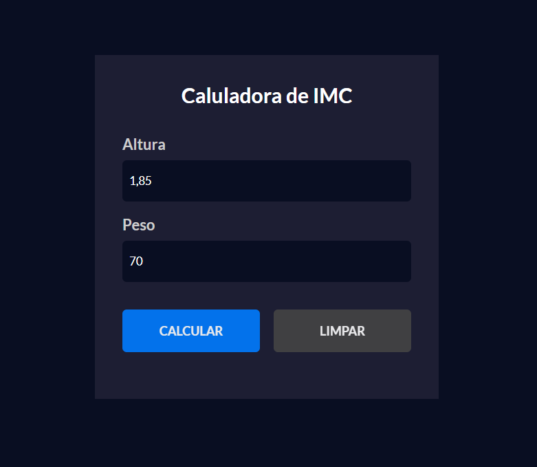
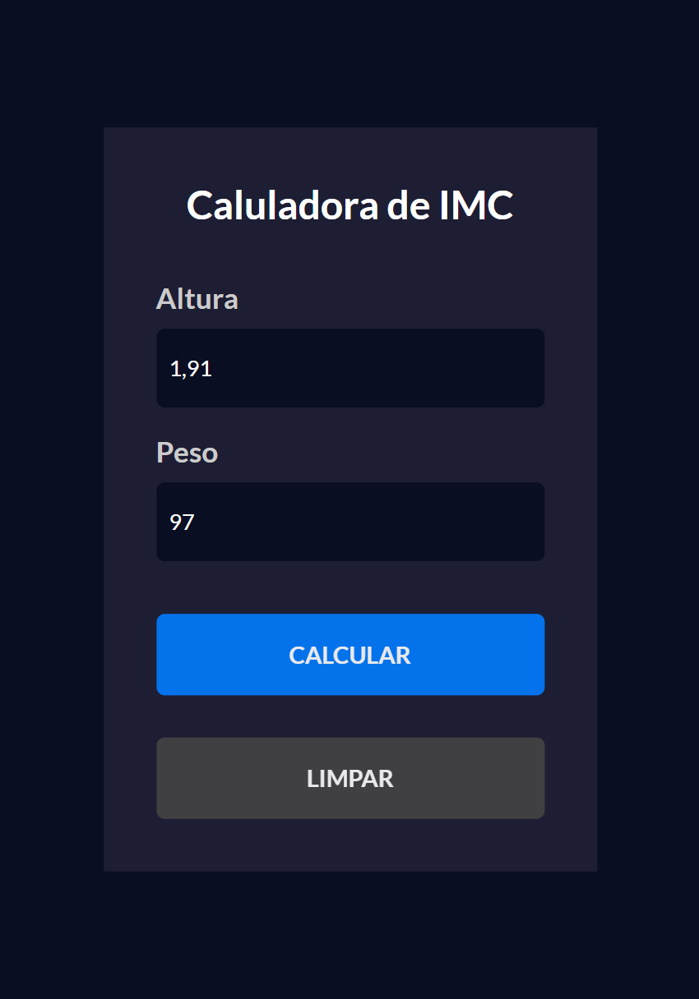
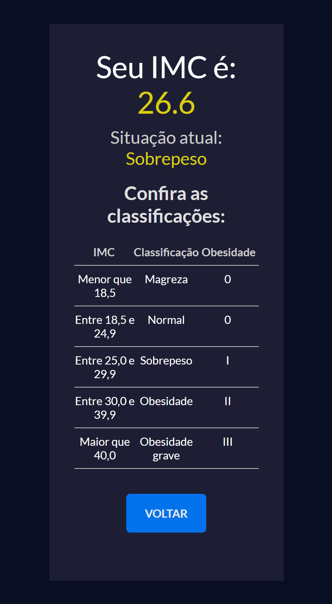

# 📊 BMI Calculator (Body Mass Index)

A clean and intuitive web application designed to calculate the user's Body Mass Index (BMI), display health classification status, and apply dynamic visual feedback based on the computed result.

---

## 📸 Screenshots

### Desktop View

|                 Calculator View                  |                   Result View                    |
| :----------------------------------------------: | :----------------------------------------------: |
|  |  |

### Mobile View

|                Calculator View                 |                  Result View                   |
| :--------------------------------------------: | :--------------------------------------------: |
|  |  |

---

## 🚀 Features

- **Real-Time Input Validation:** Filters invalid characters instantly, allowing only numbers and commas in height and weight fields.
- **Dynamic Data Table:** Automatically renders the BMI classification scale from a JavaScript object structure.
- **Accurate Calculation:** Handles decimal conversion and formatting to output the exact health index.
- **Contextual Visual Feedback:** Dynamic CSS styling that changes result colors based on classification severity (Underweight, Normal, Overweight, Obesity).
- **Smooth View Switching:** Seamless navigation between the input form and result display screens using state toggling.
- **Form Reset:** Quick reset action to clear input fields and reset UI states.

---

## 🛠️ Tech Stack

- **HTML5:** Semantic markup structure.
- **CSS3:** Custom styling and dynamic utility classes.
- **JavaScript (ES6+):** DOM manipulation, event handling (`input`, `click`), and core business logic.

---

## 📌 Future Improvements

- [ ] Add mobile responsiveness (Media Queries / Mobile-First design).
- [ ] Refactor the application using **React.js**.

---

## 📦 How to Run the Project Locally

### 1. Clone this repository:

```bash
git clone https://github.com/luisfrancisco2b/imc-calculator
```

### 2. Navigate to the project folder

```bash
cd imc-calculator
```

### 3. 🚀 Running the Project

```bash
Since this is a front-end application, you can run it directly.

Open the `index.html` file in your browser, or run it using an extension like **Live Server** in VS Code:

http://127.0.0.1:5500/index.html
```

## 👨‍💻 Author

Luis Francisco
